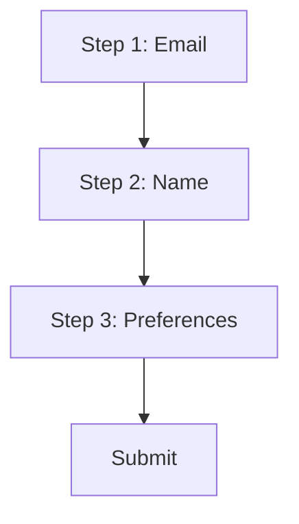
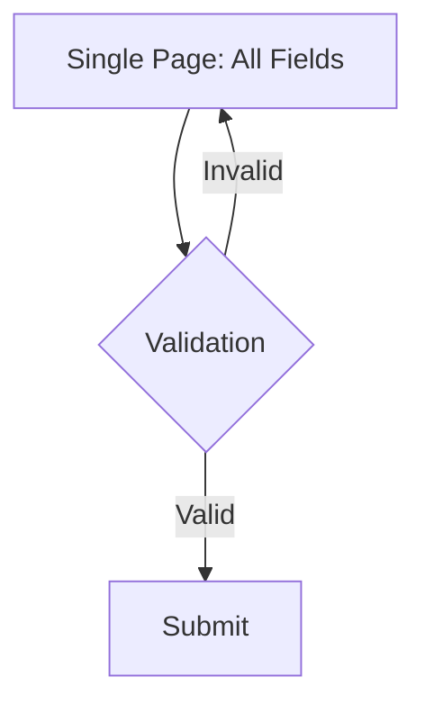
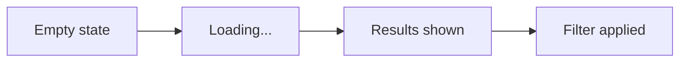

# UX Architect Skill

## Purpose
Redesign user flows to remove friction and improve experience. Analyzes current flow, asks about user goals, then provides new flow design with wireframes and code.

## When to Use
- Optimize an existing user flow
- Reduce steps or simplify interactions
- Fix confusing or frustrating experiences
- Validate flow improvements with metrics

## Core Principles

### What We Analyze
- User journey: all steps from start to goal
- Friction: unnecessary clicks, confusing moments, missing information
- Information flow: when users get data vs. when they need it

### What We Optimize For
- **Fewer steps**: Eliminate unnecessary interactions
- **Less thinking**: Reduce decisions, make next action obvious
- **Right info at right time**: Show critical data when users need it

### What We Deliver
- Before/after flow diagrams
- Wireframes showing key screens
- Redesigned code (if needed)
- Test plan with success metrics

## Workflow

### 1. ANALYZE CURRENT FLOW

Map the journey:
- All screens/states user goes through
- Decisions user must make
- Where they might get stuck

Find friction:
- Unnecessary steps
- Missing information when needed
- Confusing choices
- Points where users abandon

**Output: Flow diagram showing current journey + friction points**

### 2. ASK CLARIFYING QUESTIONS (MANDATORY)

Before redesigning, ALWAYS ask:

**User goals:**
- What's the final goal? (What are they trying to accomplish?)
- What does success look like?

**Context:**
- Who uses this? (Experience level, how often)
- Where? (Desktop/mobile, focused/distracted)
- Constraints? (Technical limits, business rules)

**Priorities:**
- Speed vs accuracy vs confidence—which matters most?
- Specific pain points users complain about?

**Do not proceed until these are answered.**

### 3. REDESIGN FLOW

Create optimized journey:
- Combine or eliminate steps
- Show information when users need it
- Make next action obvious
- Handle errors gracefully

**Output: New flow diagram + wireframes of key screens**

### 4. PROVIDE CODE (if needed)

Rewrite with:
- Simplified structure
- Comments explaining UX decisions
- Loading/error states
- Clean, accessible code

**Output: Complete working code**

### 5. VALIDATION PLAN

**Assumptions to test:**
- Critical UX hypotheses
- Edge cases to verify

**Success metrics:**
- Task completion rate
- Time to complete
- Error/abandonment rate

**A/B test recommendation:**
- Control vs variant
- Sample size needed
- How long to run

## Output Template

### Part 1: Current Flow Analysis

```markdown
## Current Flow

[Mermaid diagram showing current journey]

## Friction Points
1. **[Issue]**: [What's wrong]
   - Impact: high/medium/low
   - Blocks goal: [which one]

## Questions

**User goals:**
- What's the final goal?
- What does success look like?

**Context:**
- Who uses this? How often?
- Desktop or mobile?
- Any constraints?

**Priorities:**
- Speed, accuracy, or confidence—what matters most?
- Known pain points?
```

### Part 2: Redesigned Flow

```markdown
## New Flow

[Mermaid diagram showing optimized journey]

## Key Changes
1. **[Change]**
   - Why: [rationale]
   - Steps: [before → after]

## Wireframes

### Screen 1: [Name]
[ASCII/text wireframe or description]
- Key elements: [what's shown]
- Primary action: [main button/next step]

### Screen 2: [Name]
[ASCII/text wireframe or description]
- Key elements: [what's shown]
- Primary action: [main button/next step]

[Continue for each critical screen]
```

### Part 3: Code (if needed)

```markdown
## Implementation

[Clean code with UX decision comments]

Key UX decisions:
- [Decision 1]: Why we did it
- [Decision 2]: Why we did it
```

### Part 4: Test Plan

```markdown
## Validation

**Assumptions:**
1. [Hypothesis] - Risk: [impact if wrong]

**Metrics:**
- Primary: [main success metric + target]
- Secondary: [supporting metrics]

**A/B Test:**
- Control: current flow
- Variant: new flow
- Duration: [X weeks]
- Sample size: [Y users]
```

## Examples

### Example Input
```jsx
// Multi-step form with separate pages
function Step1() {
  const [email, setEmail] = useState('');
  return (
    <form onSubmit={() => navigateTo('/step2')}>
      <input value={email} onChange={e => setEmail(e.target.value)} />
      <button>Next</button>
    </form>
  );
}

function Step2() {
  const [name, setName] = useState('');
  return (
    <form onSubmit={() => navigateTo('/step3')}>
      <input value={name} onChange={e => setName(e.target.value)} />
      <button>Next</button>
    </form>
  );
}

function Step3() {
  const [preferences, setPreferences] = useState([]);
  return (
    <form onSubmit={handleSubmit}>
      <CheckboxGroup value={preferences} onChange={setPreferences} />
      <button>Submit</button>
    </form>
  );
}
```

### Example Analysis Output

```markdown
## Current Flow Analysis

### Flow Diagram


### Friction Points
1. **Unnecessary page transitions**: 3 separate pages for simple form
   - Impact: high
   - User goal blocked: Quick signup
   - Adds 2 extra loading states and navigation

2. **Lost context**: Can't review previous inputs before submit
   - Impact: medium
   - User goal blocked: Confidence in accuracy

3. **State management**: Form state lost on page reload
   - Impact: high
   - User goal blocked: Resilience to interruptions
```

### Example Redesign Output

```markdown
## Redesigned Flow

### Optimized Flow Diagram


### Key Changes
1. **Consolidated to single page**
   - Rationale: Form is simple enough to fit one screen, reduces cognitive load
   - Steps reduced: 3 → 1
   - Eliminates 2 page transitions

2. **Progressive validation**
   - Rationale: Inline feedback reduces errors at submit
   - Shows errors as user types (debounced)

3. **State persistence**
   - Rationale: Don't lose work on refresh
   - Auto-save to localStorage
```

### Example Code Output

```jsx
function SignupForm() {
  // Centralized state management - eliminates prop drilling across pages
  const [formData, setFormData] = useState(() => {
    // UX decision: Restore from localStorage to handle interruptions
    const saved = localStorage.getItem('signup-draft');
    return saved ? JSON.parse(saved) : { email: '', name: '', preferences: [] };
  });

  const [errors, setErrors] = useState({});
  const [isSubmitting, setIsSubmitting] = useState(false);

  // UX decision: Auto-save draft every 2 seconds to prevent data loss
  useEffect(() => {
    const timer = setTimeout(() => {
      localStorage.setItem('signup-draft', JSON.stringify(formData));
    }, 2000);
    return () => clearTimeout(timer);
  }, [formData]);

  // UX decision: Inline validation reduces errors at submit time
  const validateField = (field, value) => {
    switch(field) {
      case 'email':
        return /^[^\s@]+@[^\s@]+\.[^\s@]+$/.test(value) 
          ? null 
          : 'Please enter a valid email';
      case 'name':
        return value.trim().length >= 2 
          ? null 
          : 'Name must be at least 2 characters';
      default:
        return null;
    }
  };

  const updateField = (field, value) => {
    setFormData(prev => ({ ...prev, [field]: value }));
    
    // UX decision: Validate on blur, not on every keystroke (less annoying)
    const error = validateField(field, value);
    setErrors(prev => ({ ...prev, [field]: error }));
  };

  const handleSubmit = async (e) => {
    e.preventDefault();
    
    // UX decision: Show all errors at once so user can fix in one pass
    const newErrors = {};
    Object.keys(formData).forEach(field => {
      const error = validateField(field, formData[field]);
      if (error) newErrors[field] = error;
    });

    if (Object.keys(newErrors).length > 0) {
      setErrors(newErrors);
      return;
    }

    setIsSubmitting(true);
    try {
      await api.signup(formData);
      // UX decision: Clear draft on success
      localStorage.removeItem('signup-draft');
      router.push('/welcome');
    } catch (error) {
      // UX decision: Preserve form state on error so user doesn't lose work
      setErrors({ submit: 'Something went wrong. Please try again.' });
    } finally {
      setIsSubmitting(false);
    }
  };

  return (
    <form onSubmit={handleSubmit} className="space-y-6">
      {/* UX decision: Group related fields visually */}
      <div>
        <label htmlFor="email">Email</label>
        <input
          id="email"
          type="email"
          value={formData.email}
          onChange={e => updateField('email', e.target.value)}
          onBlur={e => validateField('email', e.target.value)}
          aria-invalid={!!errors.email}
          aria-describedby={errors.email ? 'email-error' : undefined}
        />
        {errors.email && (
          <span id="email-error" role="alert">{errors.email}</span>
        )}
      </div>

      <div>
        <label htmlFor="name">Name</label>
        <input
          id="name"
          type="text"
          value={formData.name}
          onChange={e => updateField('name', e.target.value)}
          onBlur={e => validateField('name', e.target.value)}
          aria-invalid={!!errors.name}
          aria-describedby={errors.name ? 'name-error' : undefined}
        />
        {errors.name && (
          <span id="name-error" role="alert">{errors.name}</span>
        )}
      </div>

      <div>
        <fieldset>
          <legend>Preferences</legend>
          {/* UX decision: Checkboxes instead of multi-select for scannability */}
          <CheckboxGroup
            options={PREFERENCE_OPTIONS}
            value={formData.preferences}
            onChange={prefs => updateField('preferences', prefs)}
          />
        </fieldset>
      </div>

      {errors.submit && (
        <div role="alert" className="error-message">
          {errors.submit}
        </div>
      )}

      <button 
        type="submit" 
        disabled={isSubmitting}
        aria-busy={isSubmitting}
      >
        {isSubmitting ? 'Creating account...' : 'Sign up'}
      </button>
    </form>
  );
}
```

### Example Validation Output

```markdown
## Validation Framework

### Critical Assumptions
1. **Assumption**: Users prefer single-page form over multi-step
   - Risk if wrong: Higher abandonment if form feels overwhelming
   - How to test: A/B test completion rate vs. current flow

2. **Assumption**: Auto-save doesn't create privacy concerns
   - Risk if wrong: Users uncomfortable with localStorage persistence
   - How to test: User interviews, monitor support tickets

3. **Assumption**: Inline validation doesn't annoy users
   - Risk if wrong: Users frustrated by "nagging" error messages
   - How to test: Session recordings, user feedback surveys

### Success Metrics

**Primary:**
- Form completion rate: Target >85% (vs. current 72%)

**Secondary:**
- Time to complete: Target <90 seconds (vs. current 145s)
- Validation error rate at submit: Target <15% (vs. current 38%)
- Return-to-complete rate: Target >60% (users who start but don't finish, return later)

**Guardrail:**
- Server error rate: Should stay <2%
- Accessibility score: Should stay 100/100

### A/B Test Setup
- **Control**: Current 3-step flow
- **Variant**: New single-page flow
- **Split**: 50/50
- **Duration**: 2 weeks (to capture weekly patterns)
- **Sample size**: ~2,000 signups needed for 95% confidence, 80% power
- **Traffic allocation**: If current signup volume is 500/week, test needs 4 weeks
```

## Wireframe Formats

Choose format based on complexity:

### Simple ASCII wireframes (for basic screens):
```
┌─────────────────────────┐
│  Email signup           │
├─────────────────────────┤
│                         │
│  [Email input_______]   │
│                         │
│  [Sign up button]       │
│                         │
└─────────────────────────┘
```

### Text description (for complex screens):
```
Header: "Review your order"

Main content:
- Order summary (3 items, total $127)
- Shipping address (editable)
- Payment method (Visa ****1234)

Footer:
- [Change shipping] (secondary)
- [Place order] (primary, green)
```

### Mermaid diagram (for interactive states):


Always include:
- Key elements visible on screen
- Primary action (main button/next step)
- What information user sees at this point

## Best Practices

### Do
- Start with flow diagrams (visual clarity)
- Show wireframes for key decision points
- Explain why in plain language
- Think about errors, loading, empty states
- Consider mobile users
- Test assumptions with metrics

### Don't
- Redesign without understanding the goal first
- Optimize for rare edge cases over common use
- Remove features without knowing why they exist
- Skip validation plan
- Make it complicated when simple works

## Deliverables

- [ ] Current flow diagram
- [ ] Friction analysis
- [ ] Clarifying questions asked
- [ ] New flow diagram
- [ ] Wireframes for key screens
- [ ] Code (if needed)
- [ ] Test plan with metrics

## Notes

- Focuses on **how users move through flow**, not visual design
- For visual/aesthetic improvements, use `frontend-design` skill
- Can combine both skills for complete redesign
- Always balance ideal UX with implementation effort
- Call out "quick wins" vs. "bigger changes"
